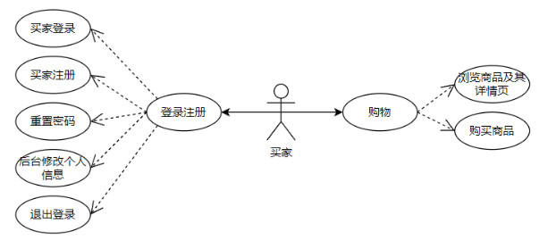
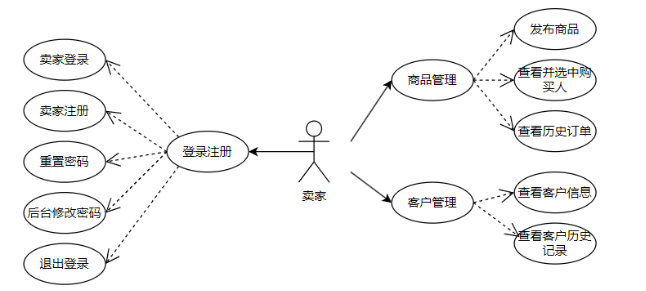

# 需求规格说明书

## 1. 用户需求

### 1.1 用户体验
- 解决用户在传统交易中信息不对称的问题。
- 提供安全、便捷的交易平台，减少线下交易不便。
- 方便商家了解商品和客户信息。
- 商家与客户可以随时修改与重置个人信息。

### 1.2 用户故事

#### 1. 作为客户
- 希望能够浏览、筛选和搜索商品信息，自由注册、登录，修改个人信息。
- 在商品详情页面提交购买意向，可以在个人后台查看历史下单记录。
- 忘记密码时可通过验证问题重置密码，也可在个人后台修改注册信息。

#### 2. 作为商家
- 希望通过注册登录，在后台管理商品，包括发布商品，查看并改变商品状态（手动下架，库存为0自动下架）。
- 查看购买意向并选择客户，查看商品历史订单，查看客户信息及其购买记录。
- 忘记密码时可通过验证问题重置密码，也可在商家后台修改注册信息。

## 2. 系统需求

### 2.1 功能需求
- **整体项目用例图**

#### 登录注册功能
- 客户与商家可在首页点击登录进行登录/注册。
- 忘记密码时，通过验证问题重置密码。
- 注册时可选择客户或商家身份，要求：
  - **用户名**（唯一）：1-30字符，仅允许文字、字母和下划线。
  - **密码**：6-15字符，包含字母、数字、特殊符号。
  - **联系电话**：11位数字，必填。
  - **倾向交易地点**：1-200字符，允许文字、数字和特殊符号。
  - **重置密码验证问题**：1-30字符，仅文字和字母。
  - **重置密码验证答案**：1-20字符，仅文字和字母。

#### 客户信息管理功能
- 从个人后台入口，已登录用户可在个人后台查看历史下单记录（商品id、商品名称、商品价格、购买人用户名、电话、地址），可以修改个人信息。未登录则跳转至登录页面。

#### 商家信息管理功能
- 从个人后台入口，已登录用户可商家后台修改密码。未登录则跳转至登录页面。

#### 商品管理功能
1. **商品信息录入**  
   - 商家在后台发布商品，填写商品名称、描述、库存、图片、价格，并选择商品类别（支持2级类别管理，如：电子产品-耳机-xxx耳机）。
   - 约束：
     - **商品名称**：1-30字符，不允许特殊字符（如<>等）。
     - **商品描述**：1-1000字符，支持富媒体（图形、图表、图片、视频等）。
     - **商品库存**：0-9999，整数。
     - **富媒体**：支持 'JPEG'、'PNG'、'MP4'、'MP3'、'PDF'、'GIF'、'SVG'，大小不超过5MB。
     - **商品价格**：浮点数，0.01-9999.99，最多两位小数。
     - **商品图片**：支持JPEG、PNG格式，大小不超过5MB，允许多张图片。
   
2. **商品状态管理**
   - **状态定义**：商品有“可售”和“下架”两种状态。
   - **状态迁移**：商家备货完成与取消订单时对库存进行更新，库存等于0时下架商品，也可手动下架商品。

3. **商品类别管理**
   - 商品支持类别筛选。

#### 购买功能

- 可在商品详情页直接进行购买，购买时可选择多个数量（不超过库存）
- 在购物车页面可选择单件或多件商品结算购买，创建订单

#### 订单管理功能

1. **状态定义**

   - **客户下单**：客户已经提交了订单。

   - **商家确认**：商家已经确认了订单。

   - **备货完成**：商家已经完成了备货。

   - **开始发货**：商家已经开始发货。

   - **交易完成**：订单已经交付给客户，交易完成，成为历史订单

2. **状态迁移**
   - **客户下单到商家确认：**商家确认订单
   - **商家确认到备货完成：**商家确认备货完成
   - **备货完成到开始发货**：商家确认开始发货
   - **开始发货到交易完成：**客户确认商品送达
   - **开始发货前：**客户可以取消订单
   - **交易完成前：**商家可以取消订单
3. **信息查看与变更**
   - 可查看下单列表，备货列表，发货列表，进行中订单列表，历史订单列表
   - 商家可在下单列表，备货列表，发货列表，进行中订单列表改变订单状态或取消订单
   - 客户可以在开始发货前取消订单，可以在订单列表确认收货

#### 购物车功能

- 商品详情页可以选择任意数量的该商品（不超过库存）加入购物车
- 购物车可以修改单件商品的数量（不超过库存）
- 购物车列表可以选择将单件商品移出购物车
- 购物车可选择多件商品进行结算

#### 收藏功能

- 商品详情页可收藏商品与取消收藏
- 可从购物车选择多件商品转为收藏
- 收藏商品的列表可以取消单件商品收藏

#### 客户信息查看功能

- 在后台查看注册的客户信息，包括购买历史（交易成功订单，呈现商品id、名称、价格、购买人用户名、电话、地址）。

#### 项目流程图
### 2.2 非功能需求
1. **系统性能**：系统响应时间应在1秒以内，保证状态变化实时反映。
2. **安全性**：商家的后台管理具备密码保护，用户信息保密。
3. **可扩展性**：支持客户个人后台增加更多需求。
4. **易用性**：界面简洁，操作步骤清晰，降低学习成本。

### 2.3 界面需求
1. **首页**
   - 搜索框、客户登录、商家登录、客户个人页面按钮以实现跳转。
   - 显示商品图片、名称、描述、价格、库存等信息，商品框固定尺寸。
   - 通过筛选得到符合类别的商品。

2. **登录页面**
   - 首页点击登录按钮，选择客户/商家身份登录。
   - 点击注册按钮进行注册，点击忘记密码以回答验证问题重置密码。

3. **注册页面**
   - 注册界面提交注册信息，并可返回登录。

4. **商品详情页面**
   - 显示商品信息，提供购买按钮，便于客户提交购买意向。

5. **个人后台**
   - 查看历史下单记录。
   - 修改个人信息。
   - 可退出登录。

6. **商家后台**
   - **商品发布页面**：提供商品信息录入功能。
   - **商品管理页面**：显示商品状态及操作按钮。
   - **意向购买人页面**：展示用户信息及选中完成、取消功能。
   - **历史记录页面**：查看商品历史订单。
   - **客户信息页面**：显示注册客户信息，提供跳转至购买信息的按钮。
   - **客户购买信息页面**：显示用户购买记录（已交易完成订单）。

## 3. 对比A版需求变动

### 3.1 修改

#### 购买功能

- 可在商品详情页直接进行购买，购买时可选择多个数量（不超过库存）
- 在购物车页面可选择单件或多件商品结算购买，创建订单

### 3.2 添加

#### 订单管理功能

1. **状态定义**

   - **客户下单**：客户已经提交了订单。

   - **商家确认**：商家已经确认了订单。

   - **备货完成**：商家已经完成了备货。

   - **开始发货**：商家已经开始发货。

   - **交易完成**：订单已经交付给客户，交易完成，成为历史订单

2. **状态迁移**
   - **客户下单到商家确认：**商家确认订单
   - **商家确认到备货完成：**商家确认备货完成
   - **备货完成到开始发货**：商家确认开始发货
   - **开始发货到交易完成：**客户确认商品送达
   - **开始发货前：**客户可以取消订单
   - **交易完成前：**商家可以取消订单
3. **信息查看与变更**
   - 可查看下单列表，备货列表，发货列表，进行中订单列表，历史订单列表
   - 商家可在下单列表，备货列表，发货列表，进行中订单列表改变订单状态或取消订单
   - 客户可以在开始发货前取消订单

#### 购物车功能

- 商品详情页可以选择任意数量的该商品（不超过库存）加入购物车
- 购物车可以修改单件商品的数量（不超过库存）
- 购物车列表可以选择将单件商品移出购物车
- 购物车可选择多件商品进行结算

#### 收藏功能

- 商品详情页可收藏商品与取消收藏
- 可从购物车选择多件商品转为收藏
- 收藏商品的列表可以取消单件商品收藏